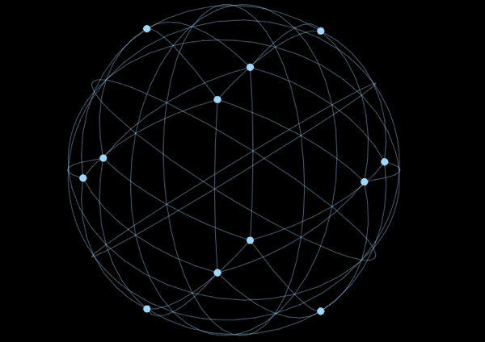

# 前言

3D-hollow-global遵循[d3.v3](https://github.com/d3/d3)设计的一个有点和线连接的3D旋转的空心球。

# 效果演示



# 代码讲解

```
var projection = d3.geo.orthographic()  
    //.clipAngle(90) // 取消注释隐藏后半圆
    .scale(240);
```
```
var point = svg.append("path")  
    .datum(d3.geodesic.multipolpoint(1)) //控制点的数量  
    .attr("class", "point"); 
```
```
var feature = svg.append("path")  
    .datum(d3.geodesic.multilinestring(2)); //控制路径的数量  

```
**[:arrow_up: 返回顶部](#前言)**
